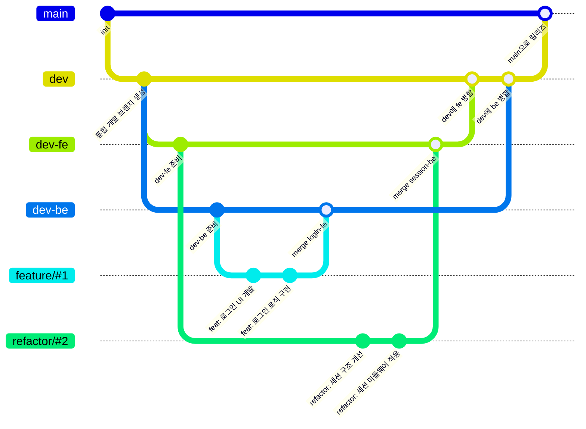

# 📋 프로젝트 개요

<div align="center">
  <a href="https://서비스링크.com">
    
  </a>
  <a href="https://github.com/softeerbootcamp-6th/Team5-HyFive/wiki">
    
  </a>
  <a href="https://spiffy-centipede-875.notion.site/HyFive-23b62570e7c480df80e3ca54de7e7a88?source=copy_link">
    
  </a>
  <a href="https://github.com/orgs/softeerbootcamp-6th/projects/5">
    
  </a>
</div>
<br/>
<p align="center">
<a href="#-서비스-소개">🎨 서비스 소개</a> <br>
<a href="#-주요-기능">📌 주요 기능</a> <br>
<a href="#-아키텍처">⚙️ 아키텍처</a> <br>
<a href="#-기술-스택">🛠 기술 스택</a> <br>
<a href="#-프로젝트-타임라인">📅 프로젝트 타임라인</a> <br>
<a href="#-팀-소개">👨‍👩‍👧‍ 팀 소개</a> <br>
</p>

# 🎨 서비스 소개


# 📌 주요 기능
(보류)

# ⚙️ 아키텍처

## CI/CD 파이프라인


## ERD


# 🛠 기술 스택

### Frontend


### Backend


### 인프라


### 협업


# 📁 폴더 구조

## 프론트엔드 폴더 구조
경량화된 atomic 기반 폴더 구조를 선택했습니다.
- components: 공통 UI 컴포넌트
- features: 특정 도메인 단위로 컴포넌트, 훅, 테스트를 묶음
- pages: 라우트 진입점으로 각 도메인을 하나의 페이지로 묶음
```
frontend/
└── src/
    ├── components/                   # 전역 재사용 컴포넌트
    │   ├── Button.tsx
    │   ├── Input.tsx
    │   └── FallbackUI.tsx
    │
    ├── features/                      # 기능(도메인) 단위 폴더
    │   ├── book/
    │   ├── calander/
    │   └── map/                       # 지도 관련 기능
    │       ├── MapComponent.tsx       # 지도 UI 컴포넌트
    │       ├── Map.style.ts           # 스타일 정의
    │       ├── Map.types.ts           # 타입 정의
    │       ├── Map.test.tsx           # 단위 테스트
    │       └── useInitializeMap.ts
    │
    ├── layouts/                        # 페이지 레이아웃
    │   ├── AdminLayout.tsx
    │   ├── BookLayout.tsx
    │   ├── CenterLayout.tsx
    │   └── index.ts
    │
    ├── pages/                          # 라우트 진입점
    │   ├── admin/
    │   └── center/
    │
    ├── routes/                         # 라우터 설정
    ├── hooks/                          # 전역 커스텀 훅
    ├── utils/                          # 유틸 함수
    ├── types/                          # 전역 타입 정의
    ├── assets/                         # 정적 파일
    │   ├── images/
    │   ├── icons/
    │   └── fonts/
    ├── styles/                         # 전역 스타일
    │   ├── themes.style.ts
    │   └── globalStyle.ts
    ├── App.tsx
    └── main.tsx
```

# 👨‍👩‍👧‍ 팀 소개

## 팀원 소개
| [김민정](https://github.com/minjeongss) | [유재민](https://github.com/jjamming) | [신지수](https://github.com/didyou88) | [성유진](https://github.com/jin20fd) |
| :--: | :--: | :--: | :--: |
|  |  |  |  |
| `Frontend` | `Frontend` | `Backend` | `Backend` |

## 협업

### Ground Rule

#### 📚 문서화

- 프로젝트 내의 **모든 것은 문서화가 필수**입니다.
- 모든 문서는 **초안은 Notion에서 작성**하고, 다듬은 후 **Wiki로 이관**합니다.
    - 이유: Notion은 **동시 편집이 용이**하기 때문입니다.

#### 📄 중요 문서 유형

- **스크럼 일지**: 오전 / 오후 스크럼 시 작성
- **회고록**: 주간 회고 시 작성
- **회의록**: 회의 큐에 기록된 회의 내용 중 중요한 회의는 별도 회의록으로 정리하여 Wiki에 업로드
- **개발 일지**: 트러블슈팅, 주요 기능 개발 과정 등을 아카이빙
  → Notion에 우선 작성, 중요 문서는 Wiki로 이동
- **발표 일지**: 금요일에 진행하는 데모데이 발표 자료 기록 및 아카이빙

---

#### 🧑‍💻 스크럼 & 업무

- **스크럼 시간 및 내용**
    - 🕙 오전 스크럼: 오전 10시
        - 오늘의 작업 예정 사항 공유
        - 간단한 안건에 대한 논의
    - 🕡 오후 스크럼: 오후 6시 30분
        - 오늘 작업한 사항 공유
        - 금요일 마무리 스크럼: 주말 작업 예정 사항 공유
        - 야근 여부(7시 이후 퇴근 여부) 공유
- **개인 집중시간 운영**
    - 오전 스크럼 ~ 점심시간 전까지는 **개인 집중 시간**입니다. → 집중을 방해하지 않도록 주의!
- **업무 공유**
    - 백로그 및 업무 현황은 **GitHub Projects**로 관리합니다.
    - 스크럼에서도 GitHub Projects를 기준으로 할 일과 한 일을 팀원들과 공유합니다.

---

#### 🗣 회의

- **회의 큐 시스템 도입**
    - 팀의 모든 논의 사항은 **회의 큐 페이지**에 기록합니다.
    - 팀원들과 이야기 나누고 싶은 사항에 대해 **언제든지 회의 큐 페이지에 작성**할 수 있습니다.
    - 검토자는 내용을 확인하고, 모두 확인되면 큐 상태를 변경합니다.
    - 회의가 필요하면 스크럼 시간 또는 Slack에서 제안하여 회의를 진행합니다.
    - 회의 결과는 회의 큐 내부에 기록하며, **중요 회의는 Wiki에도 업로드**합니다.

---

#### 🧘 점심 & 건강

- **점심 메뉴 정하기 시스템**
    - 슬랙에서 `오늘의 점심` 알림봇 워크플로우 운영 🍚🥄
    - 알림봇 댓글에 먹고싶은 메뉴를 작성하고 투표로 결정!
- **점심 체조 시간 운영 🤸**
    - 점심 식사 후 **새천년 체조** 실시
- **특이사항 공유**
    - 병원 일정, 야근 일정 등은 **점심시간에 미리 공유**

### 📦 프로젝트 관리

- 업무 관리 및 일정 공유는 **GitHub Projects**를 사용합니다.
- 스크럼 시에도 해당 보드를 기준으로 공유하고 피드백합니다.

### Git Convention

#### 1. Git 브랜치 이름 작성 규칙

- 브랜치 이름은 **영어 소문자**만 사용합니다.
- 구성: **유형 / 이슈 번호**

**✅ 작성 예시**
```
feat/#23
fix/#45
refactor/#51
docs/#6
```

**🔀 Git 브랜치 전략**


#### 2. Git 커밋 메시지 작성 규칙

- 커밋 메시지는 다음 형식을 따릅니다: `<타입> : <제목 요약>`
- 제목(Subject)은 **50자 이내**로 간결하게 작성합니다.
- `타입(Type)`과 `제목(Subject)` 사이에 **콜론(:)**과 **한 칸(space)**을 넣습니다.

**커밋 유형**

유형 | 설명
-- | --
feat | 새로운 기능 추가
fix | 버그 수정
refactor | 코드 리팩토링 (기능 변화 없음)
chore | 빌드, 설정 파일 등 기타 작업
docs | 문서 수정
style | 스타일 수정 (HTML, CSS, 코드 정렬 등)
test | 테스트 코드 추가 및 수정


**✅ 작성 예시**
```
feat : 로그인 기능 구현
fix : 로그인 API 에러 수정
docs : README 파일 업데이트
refactor : 회원가입 로직 개선
style : 코드 컨벤션 맞춤 정렬 적용
test : 회원가입 유닛 테스트 추가
chore : gitignore 파일 추가
```

#### 3. 템플릿
##### PR template
```markdown
## #️⃣ 연관된 이슈
Close 

## 📝 기능 설명
<!-- 제안하는 기능에 대해 명확하고 간단히 설명해주세요 -->

## 🛠 작업 사항
<!-- 구현한 작업 내용을 설명해주세요 -->

## ✅ 작업 항목
- [ ] 작업 1
- [ ] 작업 2

## 📎 참고 자료
<!-- 관련 문서, 링크, 스크린샷 등을 첨부해주세요 -->
```


##### Issue template
```markdown
## 🎯 작업 목표  
<!-- 작업 목표에 대해 설명해주세요 -->

## ✅ 작업 항목

- [ ] 작업 1
- [ ] 작업 2

## 📅 예상 마감일  
예: 2025-08-02

## 🔗 관련 이슈 또는 PR (선택)
예: #3, #12
```

## 📅 회고

- **주간 회고**: 매주 금요일 진행
    - 팀 전체의 관점에서 **잘한 점 / 개선할 점 / 보완할 점** 공유
        - 보완할 점은 **회고를 진행하면서 즉시 구체적으로 작성**
    - 팀원 별로 그 주 MVP 였던 순간 선정
    - 개선할 점은 스스로 작성하고, 팀원들이 개선 방법 공유해주기
    - 🍽️ 가장 맛있었던 **식사 메뉴 회고**도 함께 진행!
